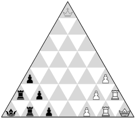
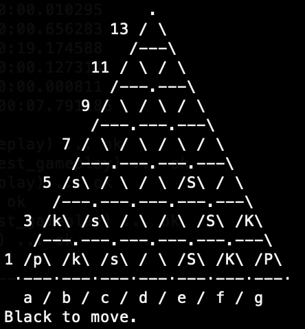

Two Princes battle for the empty throne!


*Copyright © 1989 Alberto Hernández Marcos*

## Inspired in chess

*The Crown* is a board game in which two players battle for their Prince's crowning on a triangular board. Each opponent has six pieces, placed on opposite vertices of the board. The remaining vertex, which they will fight to conquer, is the *crown* or *crowning cell*.

The game puts most of chess' original flavour (captures, checks, promotions, strategies...) on a different landscape, simplifying gameplay to three piece types -Prince, Knight and Soldier- who move pretty much like their square-world relatives.



*Starting position of The Crown*

**About the game**

- Learn here the [game rules](thecrown/docs/gamerules.md).
- A comparison between Chess and *The Crown* (coming soon).
- Strategies for opening, middle game and endgame (coming soon).

## A program to play "The Crown"

Since not many people knew the game, this year I decided to build a program to play against and... well, actually learn how to play it! The version in this repo CAN finally play really good matches from opening to endgame (and keeps teaching me my own game...).

I really hope you enjoy it!

### Prerequisites

- Python 3.7+
- pip

### Installation

Clone this repo into your computer with *git* (if you don't have it, [learn how here]).

[learn how here]: https://git-scm.com/book/en/v2/Getting-Started-Installing-Git

```bash
$ git clone https://github.com/Alberto-Hache/the-crown.git
```

Now go to the newly created directory and run the included *Makefile* to install the required libraries:


```bash
$ cd the-crown
$ make init
```

### Testing the program

Once *The Crown* is installed, you can test it by running it with default arguments. Make sure you are at the home directory (./the-crown), and from there type:

```bash
$ make run
```

This should start a machine-vs-machine game in good-old-fashioned text mode on your terminal with search depth 3 (which, if you know some game theory, is a bit shallow, but plays at a reasonable level at a very fast speed!)...


### Further testing

To run all unit tests make sure you are at the home directory (./the-crown), and from there type:

```bash
$ make test
```

This will run a thorough set of tests on all core functionality:

- Overall gameplay
- Board management functionality
- Auxiliary functions

### Playing a quick game

To play a game against this program, make sure you are at the home directory (./the-crown). Now type:

```bash
$ python crown.py human crowny-iii
```

This will start a game between you, playing white, and the program playing black with depth three full-width search. As white, you will be prompted for the first move.

```
Type move for White (Q to quit):
````

You must enter the coordinates of origin and destination cells for one of your pieces. For example, beginning with e5d5 will move one of your Soldiers towards your opponent while clearing a line for one Knight:

This should start a machine-vs-machine game in good-old-fashioned text mode on your terminal with search depth 3 (which, if you know some game theory, is a bit shallow, but plays at a reasonable level at a very fast speed!)...




The program will play as black now and, at level 3 (i.e. iii), it shouldn't take more than a couple of seconds per move. Good luck!

### Program arguments

When calling crown.py, arguments are interpreted like this:

- Player names are allocated White and Black in this order. If less than two names are passed, a default machine-player is assigned.

    Example: play a game as black against level 4.

    ```bash
    $ python crown.py crowny-iv human
    ```

    Possible values of players are:

        human       # A user will type moves for this side.
        crowny-i    # The computer will play this side at level 1.
        crowny-ii   # The computer will play this side at level 2.
        ...         # etc. for crowny-iii, -iv, -v, -vi and -vii.

- The game can start from some predefined position if passed as argument.

    Example: start playing from position strategy_01.cor (a file in ./thecrown/games/) as white vs level 5.

    ```bash
    $ python crown.py human crowny-v strategy_01.cor
    ```

- Finally, an integer can be passed to limit the number of moves to play. This is useful to analyze positions.

    Example: play the first three moves at level 6 for black and white in position strategy_03.cor.

    ```bash
    $ python crown.py strategy_05.cor crowny-vi crowny-vi  3
    ```

### Author

Alberto Hernández Marcos

I created this game in 1989, during my last year before graduating from the University. My passion for chess inspired this deliberately simplified version of the greatest game ever conceived. After slight retouches to the original rules and having enjoyed numerous games with both human and machine players, I think I got what I aimed for: an interesting, simpler variation with a different but straightforward goal, yet retaining most chess concepts.

### License

This project is licensed under GNU General Public License 3.0 - see the [LICENSE] file for details.

[LICENSE.md]: LICENSE
