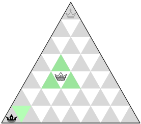
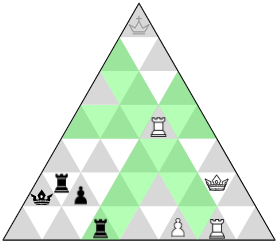
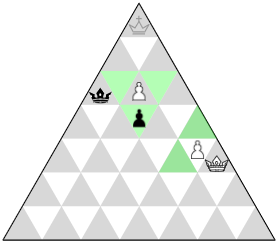
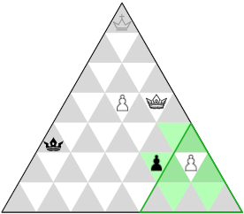
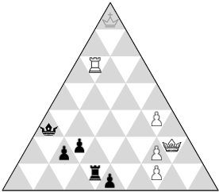
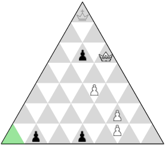
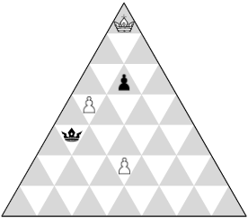
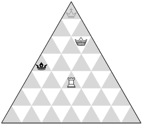

# Game rules

*Copyright © 1989 Alberto Hernández Marcos*

## Starting position
White begins, turns alternate.

## Movement of Pieces

### Prince

Princes can only move (or capture) one cell at a time.

### Knight

Knights dominate the field in all three directions.

### Soldier

Soldiers move normally one cell at a time...

… but in their kingdom they can advance two cells.

### Limitations

- Pieces cannot be leaped over.
- The Prince can never be left in check!

## Checkmate - loss of turn

A checkmated Prince must leave the board and… yield the turn.

NOTE: The game goes on since the opponent  is not yet king.

## Soldier promotion

Soldiers reaching their Prince’s starting position promote to Prince.

NOTE:
- The new Prince cannot be left in check.
- Players can only have one Prince.

## Victory

### Crowning

White wins: their Prince has reached the crown.

### Annihilation

A player wins too if, keeping the Prince, the opponent is left with no pieces.

## Draw

### Stalemate

It’s black’s move, but their Prince is stalemated.

### No Princes left

The game is a draw as well if no Princes are left on the board.

### Threefold repetition

The game is a draw if the same position occurs three times with the same player to move.
