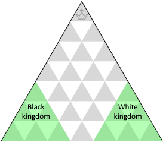

# Game rules

*Copyright © 1989 Alberto Hernández Marcos*

## Starting position
Just like in chess, White begins and turns alternate.

## Movement of Pieces

Piece moves and captures are very resembling of chess.

### Prince

Princes can only move (or capture) one cell at a time, being the weakest piece.

### Knight

Knights dominate the field in all three directions and have a maximum mobility of 23 moves.

*~White to move: the black Knight can be captured~*

### Soldier

Soldiers move normally one cell at a time...

*~ Moves of the White Soldiers~*

But in their kingdom they can advance two cells. 

*~Moves of a White Soldier in its kingdom~*

Players' kingdoms are defined by the starting area of each side:

### Limitations to all pieces

- Pieces cannot be leaped over.
- The Prince can never be left in check, just like the King in chess!

## Checkmate and loss of turn

When checkmated, the Prince must leave the board and… yield the turn.

*~Black to move, but its Prince is checkmated~*

*After the black Prince leaves it's White's move again (this game would go on since the opponent is not yet King).*

## Soldier promotion

Soldiers reaching their Prince’s starting position promote to Prince.

*~Black to move: this Soldier can promote to Prince~*

NOTE:
- The new Prince cannot be left in check.
- Players can only have one Prince.

## Victory

### Crowning

A player wins when its Prince has reached the crown.

### Annihilation

A player wins too if, keeping the Prince, the opponent is left with no pieces.

## Draw

### Stalemate

The game is a draw when the player to move has no legal move and is not in check.

*~It’s Black’s move, but its Prince is stalemated~*

### No Princes left

The game is a draw as well if no Princes are left on the board.

### Threefold repetition

The game is a draw if the same position occurs three times with the same player to move.
